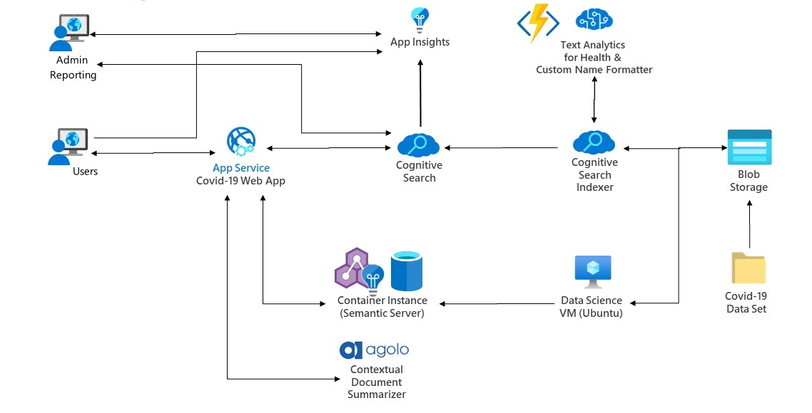

# Covid-19 Search App - Code Repository

## Overview

Source Code Repository for the Cognitive Search based [Covid-19 Search App](https://covid19search.azurewebsites.net/)

If you simply want to show this code in a running instance, feel free to use <https://covid19search.azurewebsites.net>.  Otherwise, you can follow the [setup instructions](#setup) below to recreate your own instance in your Azure subscription.  

This repository contains:

* AzureCognitiveSearchService: The components to set up the Cognitive Search service
* Concatenator: An Azure Function to reformat names which is invoked as a custom skill
* InvokeHealthEntityExtraction: An Azure Function to call the Text Analytics for Health container which is invoked as a custom skill

## Purpose

There is an overwhelming amount of information (and misinformation) about COVID-19.  How can we use AI to better understand this novel coronavirus?  In this code, we take an [open dataset of research papers on COVID-19](https://www.semanticscholar.org/cord19/download) and apply several machine learning techniques (name entity recognition of medical terms, finding semantically similar words, contextual summarization, and knowledge graphs) which can help first responders and medical professionals better find and make sense of the research they need.  

## Architecture

Data is pulled from two folders in the same Azure blob storage container. The main indexer runs data in json format through a skillset which reshapes the data and extracts medical entities, and puts the enriched data in the search index. A second metadata indexer pulls additional metadata into the same search index.

## Setup

First, you will need an Azure account.  If you don't already have one, you can start a free trial of Azure [here](https://azure.microsoft.com/free/).  

Secondly, our implementation uses the [Text Analytics for Health](https://docs.microsoft.com/en-us/azure/cognitive-services/text-analytics/how-tos/text-analytics-for-health?tabs=ner) container for medical entity extraction.  Once you have received access, you will need to set up the container as instructed in their README.  Then, you will need to update the InvokeHealthEntityExtraction Azure function with the location of your running container.  You will also need to download a file umls_concept_dict.pickle that is too big to host on GitHub, which will allow lookup of [UMLS](https://www.nlm.nih.gov/research/umls/index.html) entities.  

Specifically, in the InvokeHealthEntityExtraction\InvokeHealthEntityExtraction folder:

* In  __init__.py file, change the ta_url variable to the URL of your TA Health container.  This value should look something like "http://ta-health-container.westus2.azurecontainer.io:5000/text/analytics/v3.0-preview.1/domains/health".  
* Download the [umls_concept_dict.pickle file](https://covid19storagejen.blob.core.windows.net/public/umls_concept_dict.pickle) and save to this directory InvokeHealthEntityExtraction\InvokeHealthEntityExtraction (the same directory as __init__.py) so it will deploy with the Azure function.  

*After* these two actions are complete, you can deploy the InvokeHealthEntityExtraction Azure function, as well as the Concatenator Azure function.  One easy way to deploy an Azure function is using Visual Studio Code.  You can [install VS Code](https://code.visualstudio.com/Download) and then follow some of the instructions at [this link](https://docs.microsoft.com/azure/azure-functions/functions-develop-vs-code?tabs=csharp):

1. Install the [Azure Functions extension](https://docs.microsoft.com/azure/azure-functions/functions-develop-vs-code?tabs=csharp#install-the-azure-functions-extension) for Visual Studio Code

2. [Sign in](https://docs.microsoft.com/azure/azure-functions/functions-develop-vs-code?tabs=csharp#sign-in-to-azure) to Azure

3. [Publish the function](https://docs.microsoft.com/azure/azure-functions/functions-develop-vs-code?tabs=csharp#publish-to-azure) to Azure

Don't forget to deploy both Azure functions: Concatenator and InvokeHealthEntityExtraction.  After each function is deployed, navigate to that service in the Azure portal.  Click "Functions" in the left-hand sidebar.  Then click on the function name, and then click "Get Function Url" at the top of the page.  Copy that value to a text editor for each function; you will need it later.  

Finally, create a new Azure search service using the Azure portal at <https://portal.azure.com/#create/Microsoft.Search>.  Select your Azure subscription.  You may create a new resource group (you can name it something like "covid19-search-rg").  You will need a globally-unique URL as the name of your search service (try something like "covid19-search-" plus your name, organization, or numbers).  Finally, choose a nearby location to host your search service - please remember the location that you chose, as your Cognitive Services instance will need to be based in the same location.  Click "Review + create" and then (after validation) click "Create" to instantiate and deploy the service.  

After deployment is complete, click "Go to resource" to navigate to your new search service. We will need some information about your search service to fill in the "Azure Search variables" section in the SetupAzureCognitiveSearchService.ipynb notebook, which is in the AzureCognitiveSearchService directory.  Open the notebook for details on how to do this and copy those values into the first code cell, but don't run the notebook yet (you will need to create an Azure storage account and update skillset.json first).  

Next, you will need to create an Azure storage account and upload the COVID-19 data set. The data set can be downloaded from <https://www.semanticscholar.org/cord19/download>. There are two different sections to download: the metadata and document parses. Then, back on the Azure portal, you can create a new Azure storage account at <https://portal.azure.com/#create/Microsoft.StorageAccount>. Use the same subscription, resource group, and location that you did for the Azure search service. Choose your own unique storage account name (it must be lowercase letters and numbers only). You can change the replication to LRS. You can use the defaults for everything else, and then create the storage. Once it has been deployed, update the blob_connection_string variable in the SetupAzureCognitiveSearchService.ipynb notebook. Then create a container in your blob storage called "covid19". Inside of that container, create a folder called "json" and upload the document parses data there. Then create a folder called "metadata" in the same blob container, and upload the metadata.csv file to that folder.  Finally, create another container in your blob storage account called "knowledgeStore".  After you have created it, note down the connection string to that container for later.  

Before running the notebook, you will also need to change the 4 TODOs in the skillset.json (which is also located in the AzureCognitiveSearchService folder).  Open skillset.json, search for "TODO", and replace each instance with the following:

1. **Name concatenation custom skill URI:** this value should be "https://" plus the value from the "Get Function Url" for the Concatenation function that you noted down earlier
2. **Invoke TA Health Extraction custom skill URI:** this value should be "https://" plus the value from the "Get Function Url" for the InvokeHealthEntityExtraction function that you noted down earlier
3. **Cognitive Services key:** create a new Cognitive Services key in the [Azure portal](https://portal.azure.com/#create/Microsoft.CognitiveServicesAllInOne) using the same subscription, location, and resource group that you did for your Azure search service.  Click "Create" and after the resource is ready, click it.  Click "Keys and Endpoint" in the left-hand sidebar.  Copy the Key 1 value into this TODO.  
4. **Knowledge Store connection string:** use the value that you noted down earlier of the connection string to the knowledgeStore container in your Azure blob storage.  It should be of the format "DefaultEndpointsProtocol=https;AccountName=YourValueHere;AccountKey=YourValueHere;EndpointSuffix=core.windows.net".  

Finally, you are all set to go into the SetupAzureCognitiveSearchService.ipynb notebook and run it.  This notebook will call REST endpoints on the search service that you have deployed in Azure to setup the search data sources, index, indexers, and skillset.  
